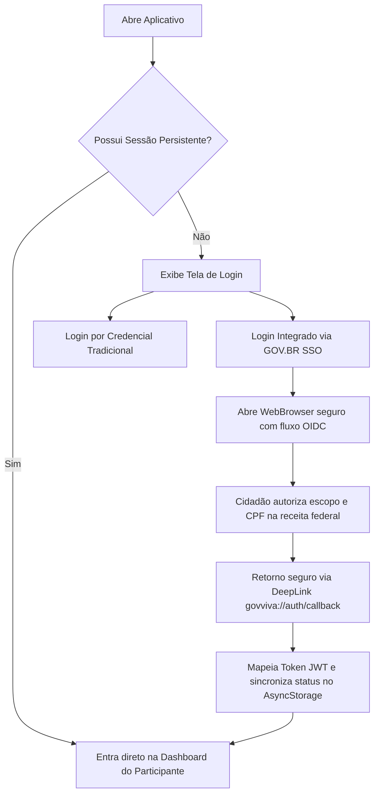

# Documentação Completa do Aplicativo Móvel GOVVIVA 📱
> **Plataforma de Desenvolvimento:** React Native (com TypeScript & Expo)  
> **Tema Visual:** Governo Tecnológico Integrado, Moderno e Inclusivo (Padrão GOVVIVA de Alta Performance)

---

## 1. Arquitetura Técnica do Aplicativo

O aplicativo móvel do **GOVVIVA** foi projetado seguindo as melhores práticas da engenharia de software para dispositivos móveis, visando estabilidade, capacidade offline-first, alta responsividade e total aderência às diretrizes da LGPD (Lei Geral de Proteção de Dados).

### 1.1. Stack Tecnológica Core
*   **Framework Principal:** React Native (Expo SDK 51)
    *   *Justificativa:* Multiplataforma nativa (iOS e Android), reduzindo o tempo de go-to-market e simplificando a manutenção de uma base única de código.
*   **Linguagem de Programação:** TypeScript
    *   *Justificativa:* Tipagem estática forte para prevenir erros em tempo de execução, especialmente nos modelos de dados de eventos, presenças e integração com GOV.BR.
*   **Gerenciamento de Estado Global:** Zustand
    *   *Justificativa:* Extremamente leve, intuitivo, sem o boilerplate do Redux clássico, ideal para sincronia rápida de estado offline/online.
*   **Estilização & UI:** Tailwind CSS via NativeWind v4
    *   *Justificativa:* Consistência com o ecossistema Web do GOVVIVA, mantendo classes utilitárias de design system fluidificadas e de carregamento ultrarrápido.
*   **Navegação:** React Navigation v6 (com TypeScript strict-types)
    *   *Navegação do Participante:* Bottom Tabs + Stack para detalhes.
    *   *Navegação do Organizador:* Gaveta (Drawer) + Bottom Tabs + Stack de Câmera dedicada.
*   **Armazenamento Local (Offline-First local storage):**
    *   *AsyncStorage:* Para persistência de Tokens JWT leves, chaves de autenticação de sessão e preferências locais.
    *   *SQLite (via expo-sqlite):* Para cache pesado off-line de listas de presença, inscrições locais e banco de dados de eventos sincronizados para os organizadores municipais operarem sem internet.

### 1.2. Estrutura de Diretórios Proposta
```text
govviva-mobile/
├── src/
│   ├── assets/             # Logos oficiais (GOVVIVA, GOV.BR), Fontes Inter e JetBrains Mono, Sons de Feedback
│   ├── components/         # Componentes compartilhados reutilizáveis (Card, Button, StatusBadge, Input)
│   ├── config/             # Configurações globais, URLs base das APIs, chaves de criptografia local
│   ├── database/           # Configuração do SQLite, migrações locais e repositórios offline
│   ├── hooks/              # Custom React Hooks (useAuth, useSync, useOfflineQueue)
│   ├── navigation/         # Configurações de rotas (Stacks, Tabs, Drawers) e tipos de rotas
│   ├── screens/            # Telas organizadas por domínios de acesso
│   │   ├── auth/           # Login, Esqueceu a Senha, Vinculação de Identidade GOV.BR
│   │   ├── citizen/        # Módulo Cidadão (Eventos, Inscrições, Certificados, QR Code)
│   │   └── organizer/      # Módulo Organizador (Check-in, Scanner QR Code, Presença, Relatórios)
│   ├── services/           # Clientes HTTP (Axios), integrações, formatadores e sincronizadores em segundo plano
│   ├── store/              # Stores do Zustand (authStore, eventStore, attendanceStore)
│   ├── types/              # Definições completas de tipos TypeScript (User, Event, AttendanceRec)
│   └── utils/              # Helpers úteis (Validador de CPF, Máscaras de input, Gerador/Validador de Assinatura de Certificado)
├── App.tsx                 # Entrypoint, inicializador de fontes, banco de dados local e Providers
├── app.json                # Configuração do Expo Build (permissões de câmera, biometria e localização)
└── package.json            # Dependências NPM e scripts de build EAS (Expo Application Services)
```

---

## 2. Fluxos e Casos de Uso do Aplicativo

### 2.1. Casos de Uso do Participante (Cidadão)

#### A. Fluxo de Autenticação Unificada (Login e GOV.BR)


#### B. Fluxo de Inscrição e Geração de Entrada Segura
1.  O Cidadão navega pela aba de **Eventos Públicos**, utilizando filtros por Secretaria (Saúde, Educação, Esportes) ou Geolocalização.
2.  Seleciona um evento e clica em **Inscrever-se**.
3.  O app verifica as condições mínimas do usuário (ex: CPF válido, limite de vagas). O status é alterado para **Inscrito**.
4.  O app gera e salva localmente no celular o **QR Code Seguro de Participação**.
    *   *Implementação Técnica:* O QR Code contém uma string JSON criptografada com algoritmo AES-256 local que armazena: `{ "regId": 1420, "userId": 88, "event": 42, "hash": "sha256-signature-of-data" }`. Esta criptografia permite a leitura офлайн pelo aplicativo do organizador, prevenindo fraudes ou representação falsa de terceiros.

#### C. Fluxo de Obtenção de Certificado
1.  Com a presença efetivada e validada, o cidadão recebe uma notificação push informando que seu **Diploma Governamental** está pronto.
2.  Aba de **Certificados**: Lista as qualificações concluídas com carga horária.
3.  Ao clicar, renderiza o certificado com visual de alta chancela pública e exibe o criptograma de assinatura digital, permitindo ao cidadão **Visualizar**, **Salvar PDF nativo** ou **Compartilhar nas Redes Sociais**.

---

### 2.2. Casos de Uso do Organizador (Gestor Público de Campo)

#### A. Fluxo de Operação Offline-First de Check-in / Check-out
O maior desafio operacional é a perda de conectividade 4G/Wi-Fi em ginásios, praças, escolas periféricas ou zonas rurais onde ocorrem as ações cidadãs do GOVVIVA. Para mitigar isso:

```mermaid
graph TD
    A[Início da Ação do Evento] --> B[Organizador clica em "Baixar Lista p/ Uso Offline"]
    B --> C[O App baixa dados de inscrições das APIs e salva no SQLite local]
    C --> D[O Organizador desliga a internet / fica Sem Conexão]
    D --> E[Abre scanner de Câmera de alta velocidade]
    E --> F[Cidadão apresenta QR Code no celular ou físico]
    F --> G[O App decodifica o QR Code, valida assinatura e faz Match no SQLite]
    G --> H[Grava registro de Check-In com timestamp e coordenada GPS no SQLite]
    H --> I[Exibe Feedback Visual Sucesso Verde com som auditivo alegre]
    I --> J[Fila de sincronização ativa]
    J --> K{Detecta rede disponível?}
    K -- Não --> J
    K -- Sim --> L[Dispara requisições em background para sincronizar presenças pendentes no Servidor]
```

---

## 3. Especificação Completa das Telas (Figma para Código)

### 3.1. Telas do Participante

#### Tela P1: Login e Integração Federal
*   **Componentes Visuais:**
    *   Header com logo do GOVVIVA em azul institucional (`#004B82`).
    *   Campos de input para E-mail e Senha tradicional com máscaras fluidas.
    *   **Botão Destaque Federal GOV.BR:** Botão largo na cor azul oficial do governo federal (`#1351b4`) com o logotipo característico da bandeira brasileira e descrição: *"Entrar com gov.br"*.
    *   Link de cadastro seguro e termos de uso em conformidade estrita com a LGPD.
*   **Comportamento / Interações:**
    *   Toque no botão GOV.BR inicia o `expo-web-browser` apontando para o endpoint OIDC simulado.
    *   Haptic Feedback (vibração leve) na digitação incorreta ou caso o nível do cidadão seja BRONZE (exibindo aviso de que precisa atualizar para Ouro/Prata para obter auto-aprovação de diplomas).

#### Tela P2: Vitrine e Filtro de Eventos Municipais
*   **Componentes Visuais:**
    *   Barra de busca inteligente por voz ou texto.
    *   Filtro horizontal por Secretarias Ofertantes (Educação, Saúde, Assistência Social).
    *   Lista de cards verticais de eventos (`FlatList` otimizada com `getItemLayout` para desempenho de milhares de itens). Cada card exibe: Título em peso extra-bold, Categoria com cor de tag representativa, Vagas restantes com barra de progresso, e data.
*   **Comportamento / Interações:**
    *   Pull-to-refresh para sincronizar eventos em tempo real.
    *   Skeleton loaders enquanto os dados de geolocalização carregam.

#### Tela P3: Painel de Inscrições e QR Code Dinâmico
*   **Componentes Visuais:**
    *   Abas horizontais divididas em *"Próximas Atividades"* e *"Concluídas / Histórico"*.
    *   Visualizador do **QR Code Seguro** do participante: Quando tocado, aumenta o brilho da tela do celular para 100% de forma temporária para facilitar a leitura física do leitor do fiscal de campo.
    *   Instruções de check-in ilustradas sob o QR code.

#### Tela P4: Meus Certificados Públicos
*   **Componentes Visuais:**
    *   Mostrador bento-grid com estatísticas acumuladas: Total de Horas Assistidas (ex: 45h), Atividades Freqüentadas (ex: 12) e Selos de Cidadania Ativa.
    *   Lista de certificados emitidos com botão de download rápido do arquivo PDF.

---

### 3.2. Telas do Organizador (Painel Administrativo de Campo)

#### Tela O1: Controle de Eventos sob Gestão
*   **Componentes Visuais:**
    *   Lista dos eventos ativos vinculados à secretaria do usuário organizador logado.
    *   Indicador de *"Modo Operacional"* com chave seletora inteligente: `Modo Síncrono` (conexão garantida) ou `Modo Assistido Off-line` (armazenamento estrito no SQLite interno).
    *   Estatísticas em tempo real: Quantidade de pessoas estimadas vs. presentes locais pré-sincronizados.

#### Tela O2: Scanner de Presença de Alta Performance
*   **Componentes Visuais:**
    *   Câmera em tela cheia com overlay quadrado delimitando a área de leitura do QR Code.
    *   Botão de ativação do Flash (para eventos noturnos ou de baixa luminosidade).
    *   Lista compacta dos últimos 3 cidadãos registrados (exibida no rodapé sobre o feed da câmera para validação visual rápida do organizador).
*   **Comportamento / Interações:**
    *   Frequência de leitura otimizada (deve processar e emitir som de confirmação em menos de **150ms**).
    *   Vibração dupla para erro (ex: QR Code inválido ou usuário já registrado em check-in) e vibração curta contínua para sucesso.

#### Tela O3: Lista Nominal Dinâmica e Ações Manuais
*   **Componentes Visuais:**
    *   Lista nominal alfabética de todos os cidadãos inscritos no evento selecionado.
    *   Pesquisa por CPF ou Nome.
    *   Botão de ação rápida de "Toggle Manual": Permite que o organizador registre o check-in ou check-out do participante em caso de tela do celular de cidadão quebrada ou perda do documento físico.

#### Tela O4: Relatório Executivo de Campo
*   **Componentes Visuais:**
    *   Gráfico de linha de distribuição de entrada (pico de horários de chegada de cidadãos).
    *   Taxa de Conversão: Inscritos que se tornaram presentes em relação aos certificados que serão habilitados.
    *   Botão para Exportar Relatório Consolidado para PDF formatado na hora do encerramento da ação governamental.

---

## 4. APIs e Endpoints Consumidos (Contrato de Integração)

O aplicativo consome uma API RESTful de alta performance que se comunica com o backend oficial do GOVVIVA, autenticada por Bearer Tokens baseados em JWT. Todos os payloads trafegam sob TLS 1.3 obrigatório.

### 4.1. Grupo de Endpoints de Autenticação e Integração GOV.BR

#### POST `/api/auth/login`
*   *Descrição:* Autenticação tradicional de usuários gestores e cidadãos.
*   *Request Payload:*
    ```json
    {
      "email": "gestor.educacao@govviva.br",
      "password": "SenhaSecretaDoGestor321"
    }
    ```
*   *Response Payload (200 OK):*
    ```json
    {
      "token": "eyJhbGciOiJIUzI1NiIsInR5cCI6IkpXVCJ9.eyJ1c2VyI...",
      "user": {
        "id": 14,
        "name": "Alexandre Silva Matos",
        "email": "gestor.educacao@govviva.br",
        "role": "ADMIN",
        "govbr_authenticated": false,
        "govbr_level": null
      }
    }
    ```

#### POST `/api/auth/govbr/simulate`
*   *Descrição:* Endpoint que simula o retorno do fluxo federado GOV.BR Single Sign-On (SSO). Ele valida e cria o vínculo de identidade de maneira automática, registrando o nível fiscal.
*   *Request Payload:*
    ```json
    {
      "name": "Mariana Ferreira Lima",
      "email": "mariana.lima@silver.gov.br",
      "cpf": "445.667.112-88",
      "govbr_level": "SILVER"
    }
    ```
*   *Response Payload (200 OK):*
    ```json
    {
      "token": "eyJhbGciOiJIUzI1NiIsInR5cCI6IkpXVCJ8...",
      "user": {
        "id": 89,
        "name": "Mariana Ferreira Lima",
        "email": "mariana.lima@silver.gov.br",
        "cpf": "445.667.112-88",
        "role": "CITIZEN",
        "govbr_authenticated": true,
        "govbr_level": "SILVER",
        "govbr_sub": "govbr-sub-FEDERATED998877AABB"
      },
      "integration": {
        "status": "SIMULATED_SUCCESS",
        "provider": "gov.br (SSO)"
      }
    }
    ```

---

### 4.2. Grupo de Endpoints de Eventos e Inscrições

#### GET `/api/events`
*   *Descrição:* Retorna a lista de todas as atividades oficiais com suas respectivas estatísticas e lotações estimadas.
*   *Request Query Params:* `?status=ACTIVE&category=Ed&page=1`
*   *Response Payload (200 OK):*
    ```json
    {
      "events": [
        {
          "id": 4,
          "title": "Ação Saúde do Homem - Novembro Azul",
          "category": "Saúde e Prevenção",
          "org_name": "Secretaria Municipal de Saúde",
          "date_start": "2026-11-20T08:00:00Z",
          "location": "Ginásio de Esportes Municipal",
          "status": "ACTIVE",
          "total_slots": 200,
          "workload": 4,
          "total_registrations": 145
        }
      ]
    }
    ```

#### POST `/api/registrations`
*   *Descrição:* Inscreve o participante de forma oficial em uma atividade gerando o hash do QR Code.
*   *Request Payload:*
    ```json
    {
      "event_id": 4
    }
    ```
*   *Response Payload (201 Created):*
    ```json
    {
      "registration_id": 512,
      "status": "CONFIRMED",
      "qr_code_hash": "GOVVIVA-REG-512-USR-89-EV-4-SIGN-99AABB",
      "message": "Inscrição confirmada com sucesso!"
    }
    ```

---

### 4.3. Grupo de Endpoints de Presença do Organizador

#### POST `/api/presence/mark`
*   *Descrição:* Marca a presença (Check-in ou Check-out) do cidadão no evento. Suporta gravação por lote em conexões recuperadas de offline.
*   *Request Payload:*
    ```json
    {
      "event_id": 4,
      "records": [
        {
          "registration_id": 512,
          "type": "CHECK_IN",
          "timestamp": "2026-11-20T08:15:32-03:00",
          "latitude": -23.55052,
          "longitude": -46.633308,
          "offline_recorded": true
        },
        {
          "registration_id": 512,
          "type": "CHECK_OUT",
          "timestamp": "2026-11-20T12:05:10-03:00",
          "latitude": -23.55054,
          "longitude": -46.63331,
          "offline_recorded": true
        }
      ]
    }
    ```
*   *Response Payload (200 OK):*
    ```json
    {
      "status": "SYNCED_SUCCESSFULLY",
      "processed_count": 2,
      "failures": []
    }
    ```

#### GET `/api/reports/event-diagnostics`
*   *Descrição:* Fornece ao organizador no campo métricas rápidas de conversão em tempo real.
*   *Request Query Params:* `?event_id=4`
*   *Response Payload (200 OK):*
    ```json
    {
      "event_id": 4,
      "total_registered": 145,
      "check_ins_count": 128,
      "check_outs_count": 115,
      "presence_percentage": 88.27,
      "certificates_ready_for_issue": 115
    }
    ```

---

## 5. Estratégias de Segurança e Robustez

1.  **Criptografia de Dados em Trânsito (TLS) & Certificados Pinnings:** Impede ataques de Man-in-the-Middle ao assegurar que o app móvel apenas dialogue com o domínio original do GOVVIVA.
2.  **Proteção Antimanosseio (Anti-Tampering) do QR Code:** A assinatura digital SHA-256 no payload do QR Code do participante impede que usuários simulem códigos falsos para ganhar presenças sem comparecer ao local.
3.  **Local Storage Encriptado (Expo SecureStore):** Armazena o Token JWT e dados biométricos sensíveis de login utilizando a camada de segurança do próprio sistema operacional (iOS Keychain e Android Keystore).
4.  **Resiliência Máxima Síncrona/Assíncrona:** O mecanismo de retry exponencial do Axios com fila de tarefas em background garante que nenhum check-in efetuado em praças ou locais sem rede móvel seja perdido quando o dispositivo recuperar o acesso à internet.
